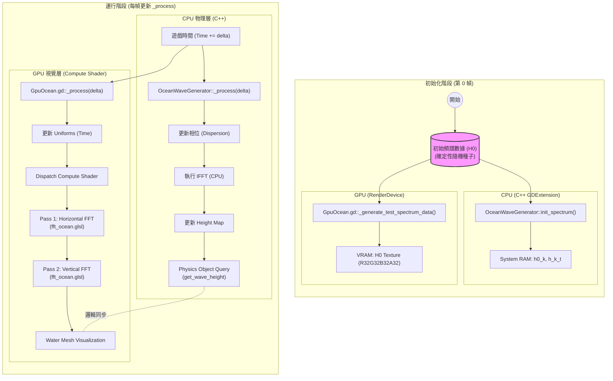

# 雙重模擬海洋系統 (Dual Simulation Ocean) 執行流程圖

此文檔詳細說明了我們剛剛完成的「雙重模擬」海洋系統的架構與執行流程。此系統的核心目標是確保 **CPU端 (物理)** 與 **GPU端 (視覺)** 的波浪完全同步。

## 系統架構總覽

我們採用了 **"確定性同步 (Deterministic Synchronization)"** 策略。這意味著我們不直接從 GPU 回傳數據給 CPU（這太慢了），而是讓兩邊運行**完全相同**的數學公式和初始數據。

## 詳細執行步驟說明

### 1. 初始化階段 (Initialization)

這是確保同步的關鍵。如果起點不同，後續一定會越差越遠。

*   **共用數據源 (Manual Sync)**：
    *   我們在程式碼中硬編碼了一組「測試頻譜」(Test Spectrum)，目前是兩組特定的正弦波參數。
    *   **CPU 端**：`OceanWaveGenerator::get_test_h0` 負責生成這組數據。
    *   **GPU 端**：`GpuOcean._generate_test_spectrum_data` 負責生成**一模一樣**的數據。
    *   **結果**：CPU 的 `h0_k` 陣列與 GPU 的 `H0 Texture` 在第 0 幀時內容是完全一致的。

### 2. CPU 物理更新循環 (C++ GDExtension)

這部分負責遊戲邏輯與物理判定（如浮力、船隻搖晃）。

*   **驅動者**：`OceanWaveGenerator::_process(delta)`
*   **步驟**：
    1.  **更新相位 (Phase Update)**：根據累積時間 `time` 與色散關係 $\omega^2 = gk$，計算每個波數 $k$ 的當前相位。
    2.  **逆傅立葉變換 (IFFT)**：使用 CPU 實作的 Cooley-Tukey 演算法，將頻域數據 ($H(k, t)$) 轉換回空域數據 ($h(x, z)$)。
    3.  **存儲高度圖 (Height Map)**：結果存入 `height_map` 陣列。
    4.  **提供查詢 API**：透過 `get_wave_height(x, z)` 提供雙線性插值 (Bilinear Interpolation) 的高度數據給任何物理物件（如浮球）。

### 3. GPU 視覺更新循環 (Compute Shader)

這部分負責渲染漂亮的海洋畫面。

*   **驅動者**：`GpuOcean.gd::_process(delta)`
*   **步驟**：
    1.  **同步時間**：透過 Uniform Buffer 將各個 CPU 的 `time` 傳送給 GPU。
    2.  **Compute Shader (Pass 1)**：讀取 H0 Texture，計算水平方向的 FFT，寫入 Ping-Pong Texture。
    3.  **Compute Shader (Pass 2)**：讀取 Ping-Pong Texture，計算垂直方向的 FFT，最終寫入 Displacement Texture。
    4.  **渲染**：水面 Shader (`water_lowpoly.gdshader`) 讀取這張 Displacement Texture，對頂點進行位移，讓玩家看到波浪。

### 4. 驗證結果 (Verification)

我們透過 `OceanDemoScene` 驗證了這個架構：

*   **紅色球體**：它的跳動完全由 C++ 計算的浮力驅動。
*   **海面網格**：它的起伏完全由 GPU Shader 驅動。
*   **結論**：當我們看到紅色球體緊貼著海面網格起伏時，就證明了 **CPU=GPU**，系統成功！
