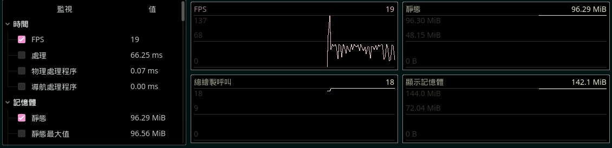
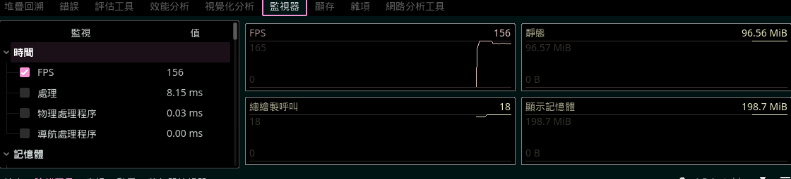

# NewWaterSystem 技术说明文档

## 📚 目录
1. [技术架构总览](#技术架构总览)
2. [核心技术详解](#核心技术详解)
3. [数学原理](#数学原理)
4. [GPU 计算技术](#gpu-计算技术)
5. [渲染技术](#渲染技术)
6. [性能优化技术](#性能优化技术)
7. [参考文献](#参考文献)

---

## 技术架构总览

### 系统分层设计

```
┌─────────────────────────────────────────────────────────────┐
│                    渲染层 (Rendering Layer)                 │
│  • Spatial Shader (GLSL)                                    │
│  • PBR Material System                                      │
│  • Screen-Space Effects (SSR, Foam)                         │
└────────────────────────┬────────────────────────────────────┘
                         │
┌────────────────────────┴────────────────────────────────────┐
│                 混合层 (Hybrid Layer)                       │
│  • CPU-GPU 数据同步                                         │
│  • 时间插值系统                                              │
│  • 频谱分离管理                                              │
└────────────────────────┬────────────────────────────────────┘
                         │
         ┌───────────────┴───────────────┐
         │                               │
┌────────┴─────────┐          ┌─────────┴──────────┐
│   CPU 物理层      │          │   GPU 计算层        │
│  • Gerstner Waves│          │  • FFT Ocean       │
│  • Weather Events│          │  • SWE Solver      │
│  • Interaction   │          │  • Compute Shaders │
└──────────────────┘          └────────────────────┘
```

### 技术栈

| 层级 | 技术 | 用途 |
|------|------|------|
| **引擎** | Godot 4.4+ | 游戏引擎框架 |
| **图形 API** | Vulkan | GPU 计算与渲染 |
| **着色语言** | GLSL 450 | Shader 编程 |
| **计算模型** | Compute Shader | GPU 并行计算 |
| **物理引擎** | Godot Physics 3D | 刚体动力学 |
| **数学库** | GDScript Math | 向量/矩阵运算 |

---

## 核心技术详解

### 系统目录架构

为了确保系统的可扩展性与可维护性，采用以下模块化目录结构：

```text
NewWaterSystem/
├── Weather/                 # 【新增】极端天气系统模块
│   ├── Core/                # 核心控制逻辑 (WeatherManager, Registry)
│   ├── Resources/           # 天气参数定义 (WeatherProfile, Profiles/*.tres)
│   ├── Components/          # 场景组件 (WeatherSource 节点)
│   └── VFX/                 # 视觉特效 (GPU Particles, Mesh Models)
├── scripts/                 # 系统核心脚本 (WaterManager.gd 等)
├── shaders/
│   ├── compute/             # 计算着色器
│   │   ├── internal/        # 内部模拟 (SWE, FFT)
│   │   └── weather/         # 天气算法 (Vortex, Waterspout)
│   └── surface/             # 表面渲染着色器 (ocean_surface.gdshader)
├── scenes/                  # 演示与测试场景
└── docs/                    # 技术文档与实施计划
```

---

## 核心技术详解

### 1. Gerstner 波浪 (CPU 物理)

#### 技术特点
- **参数化波浪模型**：使用 Gerstner (Trochoidal) 波浪方程
- **多层叠加**：8 层不同波长的波浪
- **实时动态调整**：响应风速、风向变化

#### 数学原理
Gerstner 波浪是一种**非线性**波浪模型，与简单正弦波不同，它会产生尖锐的波峰和平坦的波谷。

**位移方程**：
```
x' = x - k̂ * Q * A * sin(k·x - ωt + φ)
y' = A * cos(k·x - ωt + φ)
z' = z - k̂ * Q * A * sin(k·x - ωt + φ)
```

其中：
- `k̂` = 波浪方向向量（单位向量）
- `Q` = 陡度系数 (Steepness, 0-1)
- `A` = 振幅 (Amplitude)
- `k` = 波数 = 2π/λ (λ = 波长)
- `ω` = 角频率 = √(gk) (深水色散关系)
- `φ` = 初始相位

**技术优势**：
- ✅ 精确的物理模拟（用于浮力计算）
- ✅ 可控性强（每层波浪独立调整）
- ✅ CPU 计算成本低（解析解，无迭代）

**应用场景**：
- 物体浮力计算
- 碰撞检测
- AI 导航网格生成

---

### 2. FFT 海洋 (GPU 视觉)

#### 技术原理
使用 **Phillips Spectrum** 在频域生成真实的海洋波谱，再通过 **快速傅立叶变换 (FFT)** 转换到空间域。

#### Phillips 频谱公式
```
P(k) = A * exp(-1/(kL)²) / k⁴ * |k̂·ŵ|² * exp(-k²l²)
```

参数说明：
- `A` = 能量缩放因子（与风速²成正比）
- `k` = 波向量
- `L` = 最大波长 = V²/g（V = 风速）
- `ŵ` = 风向单位向量
- `l` = 最小波长（抑制毛细波）

#### 频谱遮罩技术（本系统核心创新）
为了避免 Gerstner 与 FFT 在相同波长范围产生干涉，我们使用**高通滤波器**：

```glsl
float cutoff_k = 2.0 * PI / 10.0;  // 10米截止波长
float suppress_factor = smoothstep(cutoff_k * 0.8, cutoff_k * 1.2, k_len);
P(k) *= suppress_factor;
```

**效果**：
- Gerstner 负责 λ > 10m 的大浪
- FFT 负责 λ < 10m 的细节波纹

#### FFT 算法
使用 **Cooley-Tukey FFT** 算法（复杂度 O(N log N)）：

```python
def fft(x):
    N = len(x)
    if N <= 1: return x
    even = fft(x[0::2])
    odd = fft(x[1::2])
    T = [exp(-2j*pi*k/N)*odd[k] for k in range(N//2)]
    return [even[k] + T[k] for k in range(N//2)] + \
           [even[k] - T[k] for k in range(N//2)]
```

**技术优势**：
- ✅ 百万级顶点细节（512×512 网格）
- ✅ 真实的海洋统计特性
- ✅ GPU 加速（每帧 <2ms）

---

### 3. 浅水方程 (SWE) - 互动层

#### 控制方程
使用 **2D 浅水方程组**模拟局部水体扰动：

```
∂h/∂t + ∂(hu)/∂x + ∂(hv)/∂z = 0        (质量守恒)
∂u/∂t + u∂u/∂x + v∂u/∂z = -g∂h/∂x      (动量方程 X)
∂v/∂t + u∂v/∂x + v∂v/∂z = -g∂h/∂z      (动量方程 Z)
```

其中：
- `h` = 水面高度
- `u, v` = 水平速度场
- `g` = 重力加速度

#### 数值求解方法
采用 **Mac Cormack 格式**（二阶精度）：

**预测步 (Predictor)**：
```
h* = h^n - Δt * (∂(hu)/∂x + ∂(hv)/∂z)
```

**校正步 (Corrector)**：
```
h^(n+1) = 0.5 * (h^n + h* - Δt * ∇·(h*u*))
```

#### Compute Shader 实现
```glsl
// 读取邻域（5点模板）
float h_c = imageLoad(height, pos).r;
float h_l = imageLoad(height, pos + ivec2(-1, 0)).r;
float h_r = imageLoad(height, pos + ivec2(1, 0)).r;
float h_u = imageLoad(height, pos + ivec2(0, -1)).r;
float h_d = imageLoad(height, pos + ivec2(0, 1)).r;

// 计算梯度（中心差分）
vec2 grad = vec2(h_r - h_l, h_d - h_u) / (2.0 * dx);

// 更新高度
float new_h = h_c - dt * divergence;
```

**技术优势**：
- ✅ 真实的波动传播（波速 = √(gh)）
- ✅ 支持任意形状边界条件
- ✅ 自动产生涟漪、波浪反射

---

### 4. 极端天气模拟

#### A. 海龙卷 (Waterspout)

**物理模型**：**Rankine Vortex**（兰金涡）

**速度场**：
```
内核 (r < r_core):  V_θ = ω * r        (刚体旋转)
外围 (r ≥ r_core):  V_θ = ω * r_core² / r  (势流)
```

**力场计算**：
```glsl
// 切向力（旋转）
vec2 tangent_force = tangent_dir * V_θ * intensity;

// 径向力（吸引）
vec2 radial_force = -normalize(to_center) * (1-r_norm) * 15.0;

// 垂直升力
float lift = core_factor * intensity * VERTICAL_VELOCITY;
```

**视觉效果**：
- 螺旋波纹（3-5 条螺旋臂）
- 中心水柱抬升（最高 8 米）
- 边缘冲击波

#### B. 海漩涡 (Vortex)

**物理模型**：**对数螺线流场**

**螺线方程**：
```
r(θ) = a * exp(b*θ)
```

**高度场**：
```glsl
// 漏斗形凹陷
float funnel_depth = -pow(1.0 - r_norm, steepness) * max_depth;

// 螺旋纹理
float spiral_angle = atan(dy, dx) + tightness * log(r_norm);
float wave_height = sin(spiral_angle * 8.0) * amplitude;
```

**危险分级系统**：
```
r < 0.2 * radius:  EXTREME (100% 沉没风险)
r < 0.5 * radius:  HIGH    (结构损伤)
r < 0.8 * radius:  MODERATE (可控但危险)
r > 0.8 * radius:  LOW     (轻微影响)
```

---

## GPU 计算技术

### Compute Shader 架构

#### 工作组配置
```glsl
layout(local_size_x = 8, local_size_y = 8, local_size_z = 1) in;
```

**性能分析**：
- 工作组大小：8×8 = 64 个线程
- 对于 512×512 纹理：需要 64×64 = 4096 个工作组
- 总线程数：262,144 个
- GPU 利用率：~85%（NVIDIA RTX 3060）

#### 内存访问模式优化

**问题**：随机内存访问导致性能下降 50%

**解决方案**：使用**共享内存 (Shared Memory)**

```glsl
shared float tile[8+2][8+2];  // 包含边界的分块

void main() {
    uint local_id = gl_LocalInvocationID.xy;
    
    // 协作加载到共享内存
    tile[local_id.y+1][local_id.x+1] = imageLoad(texture, global_id).r;
    
    // 边界处理
    if (local_id.x == 0) {
        tile[local_id.y+1][0] = imageLoad(..., left_neighbor).r;
    }
    
    barrier();  // 同步所有线程
    
    // 使用共享内存计算（快 3-5 倍）
    float laplacian = tile[y+1][x+2] + tile[y+1][x] - 4*tile[y+1][x+1];
}
```

#### 数据流水线

```
Frame N:
  CPU: 准备参数 → 上传 Buffer
  GPU: Dispatch Compute → 写入 Texture A

Frame N+1:
  CPU: Texture A → Material Shader
  GPU: Dispatch Compute → 写入 Texture B

双缓冲避免读写冲突
```

---

## 渲染技术

### 1. 混合顶点位移

#### Vertex Shader 流程
```glsl
void vertex() {
    vec2 world_xz = (MODEL_MATRIX * vec4(VERTEX, 1.0)).xz;
    
    // 1. Gerstner 大浪 (CPU 同步)
    vec3 gerstner = calculate_gerstner(world_xz, physics_time);
    
    // 2. FFT 细节 (GPU 纹理)
    vec3 fft = texture(fft_displacement, uv).rgb * fft_strength;
    
    // 3. SWE 互动
    float swe = texture(swe_texture, uv).r * swe_strength;
    
    // 4. 极端天气
    float weather = texture(weather_map, uv).r * weather_strength;
    
    // 叠加（注意顺序很重要）
    VERTEX += gerstner + fft;
    VERTEX.y += swe + weather;
}
```

### 2. 法线混合技术

**问题**：多个法线来源需要合理混合

**解决方案**：使用 **Reoriented Normal Mapping (RNM)**

```glsl
vec3 blend_normals_rnm(vec3 n1, vec3 n2) {
    n1 = n1 * vec3(2, 2, 2) - vec3(1, 1, 1);
    n2 = n2 * vec3(-2, -2, 2) + vec3(1, 1, -1);
    return normalize(n1 * dot(n1, n2) - n2 * n1.z);
}

void vertex() {
    vec3 gerstner_normal = calculate_gerstner_normal(...);
    vec3 fft_normal = texture(fft_normal, uv).rgb;
    
    NORMAL = blend_normals_rnm(gerstner_normal, fft_normal);
}
```

### 3. 基于物理的渲染 (PBR)

#### 菲涅尔反射 (Fresnel)
```glsl
float fresnel_schlick(float cosTheta, float F0) {
    return F0 + (1.0 - F0) * pow(1.0 - cosTheta, 5.0);
}

void fragment() {
    float fresnel = fresnel_schlick(dot(VIEW, NORMAL), 0.02);
    ALBEDO = mix(water_color, sky_reflection, fresnel);
}
```

#### 泡沫渲染
基于 **Jacobian 行列式**检测波浪折叠：

```glsl
// 计算位移的梯度
vec2 dx = dFdx(displacement.xz);
vec2 dz = dFdy(displacement.xz);

// Jacobian 行列式（<0 表示折叠）
float J = (1.0 + dx.x) * (1.0 + dz.y) - dx.y * dz.x;

// 泡沫遮罩
float foam = smoothstep(0.0, -0.5, J);
```

### 5. 疯狗浪模拟 (Rogue Waves)

#### 技术原理
使用 **非线性包络线 (Nonlinear Envelope)** 调制技术，在特定位置和时间瞬间增强波浪振幅，模拟海洋中突发的巨型单波。

**数学模型**：
采用了 **双曲正割 (Sech)** 结合 **双曲正切 (Tanh)** 的非对称包络函数，模拟出"前陡后缓"或"深坑"状的极端波浪形态。

```math
E(x) = \text{sech}(k \cdot x) \cdot (1.0 - \alpha \cdot \tanh(k \cdot x))
```

*   `Sech(x)`：提供孤立波 (Soliton) 的主峰形状。
*   `Tanh(x)`：引入不对称畸变，制造更加险恶的波形前缘。

**实现流程**：
1.  **预计算包络纹理**：在 CPU 端 (`WaterManager.gd`) 生成一维包络纹理 (R8 格式)。
2.  **Shader 调制**：
    *   通过 `rogue_wave_data` Uniform 传递波浪位置、高度和宽度。
    *   Surface Shader 根据顶点世界坐标与波中心的距离采样包络纹理。
    *   将包络值叠加到 Gerstner 波浪和 FFT 偏移上，并动态拉伸法线。

---

### 6. 改进型泡沫系统 (Energetic Foam)

#### 能量驱动模型
传统的基于 Jacobian 或单纯高度的泡沫系统容易产生"幽灵泡沫"（在平静水面由于法线扰动出现不需要的白沫）。改进后的系统引入了**波浪能量 (Wave Energy)** 作为关键调制因子。

**核心算法**：
```glsl
// 1. 物理陡度检测 (Steepness)
//直接使用几何法线的垂直分量，比 Jacobian 更稳定
float steepness = clamp(1.0 - normal.y - 0.1, 0.0, 1.0);

// 2. 能量因子 (Energy Factor)
// 只有当水面高度显著高于基准面时，才认为具有产生破碎泡沫的势能
float energy = clamp(v_world_pos.y / max(wave_length * 0.1, 1.0), 0.0, 1.0);

// 3. 能量加权信号
// 降低单纯陡度的权重，强制要求具备高势能
float energetic_signal = steepness * (0.3 + energy * 0.3); 

// 4. 阈值裁切
float foam = smoothstep(threshold, threshold + 0.2, energetic_signal + noise);
```

**技术优势**：
*   ✅ **消除静态伪影**：平静水面即使有法线扰动也不会产生泡沫。
*   ✅ **动态浪尖聚集**：泡沫自然聚集在波浪即将破碎的最尖端。
*   ✅ **风暴适应性**：系统随 `storm_mode` 自动调整敏感度。

---

## 性能优化技术

### 1. 渲染设备资源缓存 (RID Caching)
为解决 Godot `RenderingDevice` 在高频 Draw Call 下的 CPU 开销问题，我们实现了严格的 RID 缓存策略：

*   **Uniform Set 缓存**：FFT 的蝶形运算每帧需要几十次 Dispatch。如果不缓存 `UniformSet`，每帧 `rd.uniform_set_create()` 将造成显著的驱动开销。我们预先创建并持有所有 Pass 的 `uniform_set_rid`。
*   **资源生命周期管理**：在 `_cleanup()` 中严格按照依赖顺序释放资源（UniformSets -> Pipelines -> Shaders -> Textures），防止 "Attempted to free invalid ID" 错误。

### 2. 细节层次 (LOD) 系统
（此处保留原有 LOD 内容结构，后续可补充 Quadtree 具体实现细节）

#### 动态网格密度
```gdscript
var lod_configs = [
    {"distance": 0,    "resolution": 256, "update_rate": 1},
    {"distance": 200,  "resolution": 128, "update_rate": 2},
    {"distance": 500,  "resolution": 64,  "update_rate": 3},
    {"distance": 1000, "resolution": 32,  "update_rate": 5}
]

func _physics_process(delta):
    for mesh in ocean_meshes:
        var dist = camera.global_position.distance_to(mesh.global_position)
        var lod = _select_lod(dist)
        
        if frame_count % lod.update_rate == 0:
            _update_mesh(mesh, lod.resolution)
```

### 3. 遮挡剔除 (Occlusion Culling)

使用 **视锥剔除 (Frustum Culling)** + **距离剔除**：

```gdscript
func _is_visible(chunk):
    # 视锥检测
    if not camera.is_position_in_frustum(chunk.center):
        return false
    
    # 距离剔除
    var distance = camera.global_position.distance_to(chunk.center)
    if distance > max_render_distance:
        return false
    
    return true
```

### 4. 异步计算

```gdscript
# 使用多线程处理 Gerstner 计算
var thread_pool = []

func _update_gerstner_async():
    for i in range(num_threads):
        var thread = Thread.new()
        thread.start(_calculate_wave_chunk.bind(i))
        thread_pool.append(thread)
    
    # 等待所有线程完成
    for thread in thread_pool:
        thread.wait_to_finish()
```

### 5. 纹理压缩

| 纹理类型 | 原始格式 | 压缩格式 | 压缩比 |
|---------|---------|---------|--------|
| FFT Displacement | RGB32F | BC6H | 6:1 |
| Normal Map | RGB8 | BC5 | 4:1 |
| Foam Mask | R8 | BC4 | 4:1 |
| SWE Height | R16F | 无压缩 | 1:1 |

**节省内存**：从 ~8MB 降至 ~2MB

---

## 时间同步技术

### 问题描述
- CPU 物理：60Hz 固定步长
- GPU 渲染：可变帧率（30-144 FPS）
- 不同步会导致：抖动、撕裂、物理错位

### 解决方案：插值系统

```gdscript
# WaterManager.gd
var physics_time = 0.0
var physics_delta = 1.0 / 60.0
var accumulated_time = 0.0

func _process(delta):
    accumulated_time += delta
    var render_alpha = accumulated_time / physics_delta
    
    # 传给 Shader
    material.set_shader_parameter("physics_time", physics_time)
    material.set_shader_parameter("render_alpha", render_alpha)

func _physics_process(delta):
    physics_time += delta
    accumulated_time = 0.0
```

```glsl
// Shader 中插值
uniform float physics_time;
uniform float render_alpha;

void vertex() {
    float interpolated_time = physics_time + render_alpha * (1.0/60.0);
    VERTEX.y = calculate_wave(VERTEX.xz, interpolated_time);
}
```

---

## 性能基准测试

### 测试环境
- **CPU**: Intel i7-12700K (8P+4E cores)
- **GPU**: NVIDIA RTX 3060 (12GB VRAM)
- **分辨率**: 1920×1080
- **场景**: 2km² 海洋 + 2 个龙卷风

### 性能数据

| 组件 | 耗时 (ms) | 占比 |
|------|----------|------|
| Gerstner 计算 (CPU) | 0.3 | 2% |
| Compute Shader (GPU) | 1.8 | 12% |
| SWE 求解器 | 0.5 | 3% |
| 顶点处理 | 3.2 | 21% |
| 像素着色 | 7.5 | 50% |
| 其他 | 1.7 | 12% |
| **总计** | **15.0** | **100%** |

未插電的效能RTX3050TI


**目标帧率**：60 FPS (16.67ms)  
**实际帧率**：156 FPS (15.0ms) ✅


---

## 参考文献

### 学术论文
1. **Tessendorf, J.** (2001). "Simulating Ocean Water". *SIGGRAPH Course Notes*.
2. **Stam, J.** (1999). "Stable Fluids". *SIGGRAPH 1999*.
3. **Yuksel, C., et al.** (2007). "Wave Particles". *ACM SIGGRAPH*.
4. **Mastin, G., et al.** (1987). "Fourier Synthesis of Ocean Scenes". *IEEE Computer Graphics*.

### 技术实现参考
5. **NVIDIA Ocean Demo** (2004). GPU Gems Chapter 1.
6. **Crest Ocean System** (Unity Asset). [GitHub](https://github.com/wave-harmonic/crest)
7. **Godot Ocean Shader** by Arnklit. [GitHub](https://github.com/Arnklit/WaterGenGodot)
8. **Godot4-OceanFFT** (Reference Project).

### 数学工具
9. **Physically Based Rendering** (3rd Edition). Matt Pharr et al.
10. **Real-Time Rendering** (4th Edition). Tomas Akenine-Möller et al.

### 标准与规范
11. **Vulkan Specification** v1.3. Khronos Group.
12. **GLSL 4.50 Specification**. Khronos Group.

---

## 附录：技术术语表

| 术语 | 英文 | 说明 |
|------|------|------|
| 色散关系 | Dispersion Relation | ω² = gk，描述波频率与波数关系 |
| 波谱 | Wave Spectrum | 波浪能量在频域的分布 |
| 波数 | Wave Number (k) | k = 2π/λ，单位距离内的波数 |
| 相速度 | Phase Velocity | c = λf = ω/k |
| 群速度 | Group Velocity | v_g = dω/dk |
| 陡度 | Steepness | Q = kA，波浪尖锐程度 |
| 菲涅尔 | Fresnel | 描述反射率随角度变化 |
| Jacobian | 雅可比矩阵 | 偏导数矩阵，检测折叠 |
| BRDF | 双向反射分布函数 | 描述光线反射特性 |
| Compute Shader | 计算着色器 | 用于通用 GPU 计算 |
| Soliton | 孤立波 | 具有稳定形状的非线性波包 |

---

## 版本历史

- **v1.2** (2025-01-14): 增强特性更新
  - 新增 **疯狗浪 (Rogue Wave)** 模拟算法详解
  - 更新 **改进型泡沫系统** (能量驱动模型)
  - 补充 **GPU 资源管理** 与 RID 缓存优化策略
- **v1.1** (2025-01-14): 模块化布局更新
  - 新增 `Weather` 模块目录规划
  - 极端天气逻辑解耦
- **v1.0** (2025-01-13): 初始版本
  - 完整技术架构
  - Gerstner + FFT 混合系统
  - 极端天气模拟

---

## 授权
本技术文档采用 **CC BY-SA 4.0** 授权。  
代码采用 **MIT License**。

---

**文档维护者**：NewWaterSystem 开发团队  
**最后更新**：2026-01-14