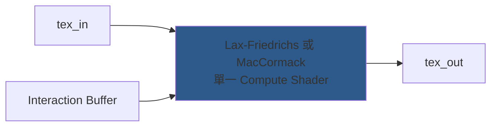
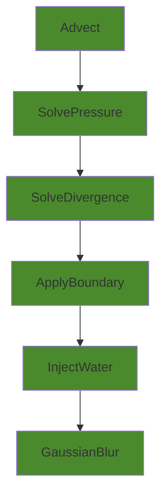

# NewWaterSystem vs Unity-SWE 差異分析

## 結論前置：你的系統更完整，但 Unity-SWE 在某些地方更嚴謹

> [!IMPORTANT]
> NewWaterSystem 是一個**完整的遊戲水體系統** (SWE + Gerstner + FFT + 漣漪 + 泡沫 + 浮力)。Unity-SWE 是**純粹的 SWE 模擬研究專案**。兩者定位不同，但 SWE 核心部分的比較很有價值。

---

## 1. SWE 方程形式對比

| 維度 | NewWaterSystem | Unity-SWE |
|------|---------------|-----------|
| **守恆變數** | `h, hu, hv`（動量形式✅） | `h, u, v`（速度形式，非守恆⚠️） |
| **通量計算** | 完整 `F=[hu, hu²/H+½gH², huv/H]` | 迎風 `F=h*u`（簡化版） |
| **x 方向通量** | ✅ 包含動量壓力項 `½gH²` | ❌ 僅質量通量 `h*u` |

> [!TIP]
> **你的動量形式更正確。** Unity-SWE 用速度場 (u,v) 而非動量場 (hu,hv)，在水位變化劇烈時可能出現非物理行為。

---

## 2. 求解器差異

### 你的 Lax-Friedrichs ([water_interaction.glsl](file:///D:/Game/Ember_of_Star_Islands/NewWaterSystem/Core/Shaders/Internal/water_interaction.glsl))

```glsl
// 完整的 Lax-Friedrichs 通量分裂
vec3 dF_dx = (F_R - F_L) / (2*dx) - 0.5*alphaX*(qR - 2*qC + qL) / dx;
// alphaX = max(|u|+c) 取各鄰居最大特徵速度
```

| 特性 | 說明 |
|------|------|
| 數值黏性 | 中等（LF 天生的數值擴散） |
| 穩定性 | ✅ 非常好，自帶數值耗散防止震盪 |
| 精度 | 一階，波形會逐漸變柔 |

### 你的 MacCormack ([water_solver_maccormack.glsl](file:///D:/Game/Ember_of_Star_Islands/NewWaterSystem/Core/Shaders/Internal/water_solver_maccormack.glsl))

```glsl
// Semi-Lagrangian 回溯 + 前推校正
phi_final = phi_n1_hat + (dataC - phi_n_hat) * 0.5;
phi_final = clamp(phi_final, v_min, v_max); // 限制器防止震盪
```

| 特性 | 說明 |
|------|------|
| 數值黏性 | 低（二階精度平流） |
| 穩定性 | 🔶 依靠限制器和 `clamp` |
| 精度 | 二階，保留更多渦旋細節 |

### Unity-SWE 的 MacCormack ([ShallowWaterSim.compute](file:///D:/Game/Ember_of_Star_Islands/Reference/Unity-SWE-main/ShallowWater/Shaders/ShallowWaterSim.compute))

```hlsl
// Predictor: 半拉格朗日插值
vel_sl = Velocity_read.SampleLevel(sampler, pos_vel_pre, 0);
// Corrector: 前推 → 後推 → 算誤差
vel_mac = vel_sl + 0.5 * error * size / dt;
// Fallback: 超界時回退到半拉格朗日
float2 final_velocity = is_in_bounds ? vel_mac : vel_sl;
```

| 特性 | 說明 |
|------|------|
| 回退機制 | ✅ 明確的 min/max bound check → 回退到半拉格朗日 |
| 壓力更新 | 分離的 `SolvePressure` kernel（`-g∇η`） |
| 高度更新 | 分離的 `SolveDivergence` kernel（迎風通量） |

---

## 3. 架構差異

````carousel
### NewWaterSystem — 單 Pass 合一



**一個 Dispatch 完成所有計算**：
通量 + 高度 + 動量 + 互動 + 雨 + 邊界

<!-- slide -->
### Unity-SWE — 多 Pass 分離



**6 個 Dispatch，每步 Ping-Pong 交換**
````

---

## 4. 功能對比表

| 功能 | NewWaterSystem | Unity-SWE |
|------|:---:|:---:|
| SWE 核心 | ✅ Lax-Friedrichs + MacCormack 可切 | ✅ MacCormack + 半拉格朗日 |
| 守恆形式 | ✅ 動量 (h, hu, hv) | ❌ 速度 (h, u, v) |
| 共享記憶體優化 | ✅ LF 求解器用 `shared tile[10][10]` | ✅ 高斯模糊用 `groupshared` |
| 障礙物系統 | ✅ Alpha 通道標記 | ✅ 地形高度比較 B_read |
| 注水/水源 | ✅ 多種模式 (衝擊/漩渦/吸引) | ✅ StructuredBuffer 多水源 |
| 雨水系統 | ✅ Hash 隨機雨滴 | ❌ |
| 邊界處理 | ✅ 海綿層漸進吸收 | ✅ 固定邊界 (速度=0, 高度鏡像) |
| 乾涸處理 | ✅ min_h clamp + 動量衰減 | ✅ h≤ε 時速度歸零 |
| 泡沫模擬 | ❌ SWE 層無（由 GPU Spray 系統處理） | ✅ 內建 SWE 泡沫 (坡度閾值) |
| 速度限制 / CFL | 🔶 只有 final clamp ±3.0 | ✅ 明確 CFL: `min(l, dx/dt*α)` |
| 高度場模糊 | ❌ | ✅ 可分離高斯模糊 |
| FFT 海浪 | ✅ 完整 Tessendorf FFT | ❌ |
| Gerstner 海浪 | ✅ | ❌ |
| 漣漪 (Ripple) | ✅ Analytic + Local Ping-Pong | ❌ |
| Kelvin 航跡 | ✅ | ❌ |
| 浮力系統 | ✅ | ❌ |
| 破碎波 (Barrel) | ✅ | ❌ |
| 渲染系統 | ✅ 完整 Ocean Shader + PBR | 🔶 ShaderGraph |

---

## 5. 你可以從 Unity-SWE 借鏡的改進

### 🔴 高優先級

**1. CFL 速度限制**  
Unity-SWE 明確執行 CFL 限制，防止模擬爆炸：
```hlsl
// Unity-SWE: 嚴格的 CFL 速度上限
float l = length(new_velocity);
if(l > 0) {
    new_velocity /= l;
    l = min(l, dx / dt * alpha); // alpha=0.5
    new_velocity *= l;
}
```
你的系統只有 final clamp `[-3.0, 3.0]`，這是一個硬限制而非物理上正確的 CFL 條件。

**2. 乾濕交界的地形處理**  
Unity-SWE 對地形互動做了更細緻的處理：
```hlsl
// Unity-SWE: 地形高於鄰居水位時，阻止流動
if((h_center <= EPS) && (b_center > eta_right)) {
    new_velocity.x = 0;
}
```
你的系統用 `is_obstacle > 0.5` 做二元判斷，沒有漸進的乾濕轉換。

### 🟡 中優先級

**3. 地形高度場 (Bathymetry)**  
Unity-SWE 有獨立的地形紋理 `B_read`，水高 h = 總高度 η - 地形 b。你的系統用 `base_depth` 常數 + obstacle alpha，地形只有「有/無」二元狀態，不支援連續變化的海床。

**4. MacCormack 回退機制**  
Unity-SWE 用鄰域 min/max 做完整的 bounds check，超出時回退到半拉格朗日。你的版本也有 `clamp(phi_final, v_min, v_max)` 限制器，但沒有完整的回退路徑。

### 🟢 低優先級（你已經做得更好的部分）

| 你做得更好的地方 | 說明 |
|------------------|------|
| 守恆形式 | 動量 (hu, hv) vs 速度 (u, v)，你的更正確 |
| 海綿邊界 | 漸進吸收比硬反射更真實 |
| 互動系統 | 多模式（衝擊/漩渦/吸引）vs 單一注水 |
| 整體功能 | FFT + Gerstner + 漣漪 + 航跡是完整水體系統 |

---

## 6. 原始碼快速導覽

| 項目 | 檔案 | 行數 | 核心功能 |
|------|------|------|----------|
| NewWaterSystem LF | [water_interaction.glsl](file:///D:/Game/Ember_of_Star_Islands/NewWaterSystem/Core/Shaders/Internal/water_interaction.glsl) | 218 | Lax-Friedrichs SWE |
| NewWaterSystem MC | [water_solver_maccormack.glsl](file:///D:/Game/Ember_of_Star_Islands/NewWaterSystem/Core/Shaders/Internal/water_solver_maccormack.glsl) | 219 | MacCormack SWE |
| NewWaterSystem Manager | [WaterManager.gd](file:///D:/Game/Ember_of_Star_Islands/NewWaterSystem/Core/Scripts/WaterManager.gd) | 3022 | 完整系統管理 |
| Unity-SWE Compute | [ShallowWaterSim.compute](file:///D:/Game/Ember_of_Star_Islands/Reference/Unity-SWE-main/ShallowWater/Shaders/ShallowWaterSim.compute) | 504 | 6 kernel SWE |
| Unity-SWE Driver | [ShallowWaterGPU.cs](file:///D:/Game/Ember_of_Star_Islands/Reference/Unity-SWE-main/ShallowWater/Scripts/ShallowWaterGPU.cs) | 364 | C# 驅動 |
