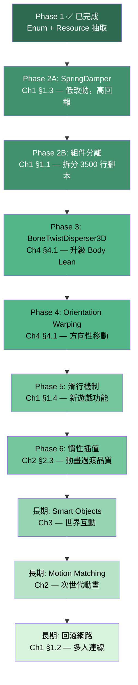

# GASP 系統文件逐章分析

基於 [Godot 4.6 手搓 UE5 GASP 系統.md](file:///D:/Game/Ember_of_Star_Islands/Player/docs/Godot%204.6%20%E6%89%8B%E6%90%93%20UE5%20GASP%20%E7%B3%BB%E7%B5%B1.md) 的分析，對照目前 `SimpleCapsuleMove.gd` 專案狀態。

---

## 第一章：Mover 系統與回滾網路 — 可行性 ★★★★☆

### 文件提出的內容

| 子節 | 核心概念 | 技術要點 |
|------|---------|---------|
| §1.1 ECS 架構 | MoverHost + MovementMode 狀態機 | 將移動邏輯封裝為獨立 Node（WalkingMode, AirMode, SlidingMode），VisualRep 分離渲染 |
| §1.2 回滾網路 | 預測 + 重模擬 | PhysicsServer3D 直接控制、State Snapshot 序列化、Input Ring Buffer |
| §1.3 臨界阻尼彈簧 | Dan Holden 的 Spring-It-On | `SpringDamper` 靜態工具類，用 halflife 控制慣性感，取代 lerp |
| §1.4 滑行機制 | 物理材質 + 動量守恆 | 碰撞形狀切換、低摩擦材質、ShapeCast3D 偵測斜坡法線 |

### 目前專案狀態對照

| 功能 | 狀態 | 說明 |
|------|------|------|
| 狀態機 | ✅ 已完成 | Phase 1 的 `MotionState` / `Gait` enum |
| 資料類 | ✅ 已完成 | `MovementData` Resource class |
| 組件分離 | ❌ 缺失 | 仍是 3500 行單一腳本 |
| 臨界阻尼彈簧 | ❌ 缺失 | 目前用 `lerp` / `move_toward` |
| 滑行機制 | ❌ 缺失 | 無此功能 |
| 回滾網路 | ❌ 缺失 | 單人遊戲暫不需要 |
| VisualRep 分離 | ❌ 缺失 | 模擬與渲染未解耦 |

### 建議行動項

> [!IMPORTANT]
> **最高優先：SpringDamper 工具類**
> - 低改動量、高回報
> - 建立 `SpringDamper.gd` 靜態類
> - 將 `halflife` 參數加入 `MovementData`
> - 替換速度計算中的 `lerp` / `move_toward` 呼叫

> [!TIP]
> **Phase 2 核心：組件分離**
> - 將 `SimpleCapsuleMove.gd` 拆分為 WalkingMode、AirMode 等獨立腳本
> - 這是管理 3500 行腳本的根本解法

> [!NOTE]
> **延後：回滾網路** — 單人遊戲無需此功能，但架構預留亦可

---

## 第二章：Motion Matching — 可行性 ★★☆☆☆

### 文件提出的內容

| 子節 | 核心概念 | 技術要點 |
|------|---------|---------|
| §2.1 資料驅動 | Pose Database + KD-Tree | Feature Vector 20-30 個 float（軌跡 + 姿勢） |
| §2.2 GDExtension | C++ 搜尋核心 | 烘焙流程：採樣→特徵提取→Z-score 歸一化→PackedFloat32Array |
| §2.3 慣性插值 | 取代 Cross-fade | 記錄姿勢偏移量 → 立即切換 → SkeletonModifier3D 衰減偏移 |

### 目前專案狀態對照

| 功能 | 狀態 | 說明 |
|------|------|------|
| 動畫系統 | ✅ AnimationTree | 使用 BlendSpace2D，傳統狀態機 |
| KD-Tree | ❌ 完全缺失 | 需 C++ GDExtension |
| 大量動畫資料集 | ⚠️ 有限 | Mixamo 動畫數量有限 |
| 慣性插值 | ❌ 缺失 | 使用標準 cross-fade |

### 建議行動項

> [!WARNING]
> **Motion Matching 是大型工程，目前不建議實作**
> - 需 C++ GDExtension 開發能力
> - 需自訂編輯器烘焙工具
> - 需數百個動畫片段
> - 社區方案 [godot-motion-matching](https://github.com/GuilhermeGSousa/godot-motion-matching) 可作長期評估

> [!TIP]
> **可提取的概念：慣性插值（§2.3）**
> - 不需完整 MM 也能改善動畫過渡品質
> - 透過 `SkeletonModifier3D` 實作偏移衰減
> - 消除 cross-fade 造成的滑步/鬼影

---

## 第三章：Smart Objects — 可行性 ★★☆☆☆

### 文件提出的內容

| 子節 | 核心概念 | 技術要點 |
|------|---------|---------|
| §3.1 InteractionResource | 資料驅動交互 | `InteractionDefinition` Resource（動畫名、Warp 偏移、Tag 過濾） |
| §3.2 場景組件 | Marker3D 插槽 | StaticBody3D + Area3D + Marker3D 定義交互點 |
| §3.3 交互管理器 | 掃描 + 預留 | InteractionSensor、評分機制、多人預約系統 |

### 目前專案狀態對照

- ❌ 無 Smart Object 系統
- ⚠️ 攀爬系統的 Raycast 偵測概念上類似

### 建議行動項

> [!NOTE]
> **延後到核心移動穩定後再實作**
> - InteractionDefinition Resource 設計模式值得記住
> - 適合在加入世界互動（門、椅子、NPC 對話點）時採用
> - Marker3D 插槽設計與 Godot 節點哲學一致

---

## 第四章：Motion Warping — 可行性 ★★★★☆

### 文件提出的內容

| 子節 | 核心概念 | 技術要點 |
|------|---------|---------|
| §4.1 朝向變形 | 上/下半身分離旋轉 | `LookAtModifier3D`（頭/頸）、`BoneTwistDisperser3D`（脊椎分散旋轉） |
| §4.2 步幅變形 | IK 修正落腳點 | `TwoBoneIK3D` + 骨盆補償（步幅↑ → 骨盆↓） |
| §4.3 MotionWarping 組件 | Warp Target 字典 | Root Motion 縮放 + 旋轉偏移，Warping Window 元數據 |

### 目前專案狀態對照

| 功能 | 狀態 | 說明 |
|------|------|------|
| Foot IK | ✅ 已有 | TwoBoneIK3D 實作 |
| Body Lean | ✅ 已有 | 手動脊椎旋轉（可升級） |
| BoneTwistDisperser3D | ❌ 未使用 | Godot 4.6 新功能 |
| Orientation Warping | ❌ 缺失 | 側跑/掃射時上身未對齊 |
| Stride Warping | ❌ 缺失 | 接觸點附近會滑步 |
| MotionWarpingComponent | ❌ 缺失 | 攀爬/翻越過渡不精確 |

### 建議行動項

> [!IMPORTANT]
> **高優先：BoneTwistDisperser3D 升級**
> - 取代手動脊椎 Body Lean 旋轉
> - Godot 4.6 內建，自動將旋轉均勻分配到 Spine1/2/3
> - 更自然的網格形變

> [!TIP]
> **中優先：Orientation Warping**
> - 改善方向性移動視覺效果
> - `LookAtModifier3D` 用於頭部追蹤
> - 計算移動方向與朝向夾角，應用於 SkeletonModifier3D

---

## 第五章：結論 — 純參考

建議後續研究：C++ GDExtension 效能優化、NavigationServer3D + MM + Smart Objects 的 AI 整合。

---

## 📋 總結：建議實作順序

> [!IMPORTANT]
> **建議下一步：先實作 Phase 2A（SpringDamper），因為它改動最小、效果最明顯。**
> 只需建立一個靜態工具類 + 修改 `MovementData` 加入 `halflife` 參數 + 替換幾處 `lerp` 呼叫。
